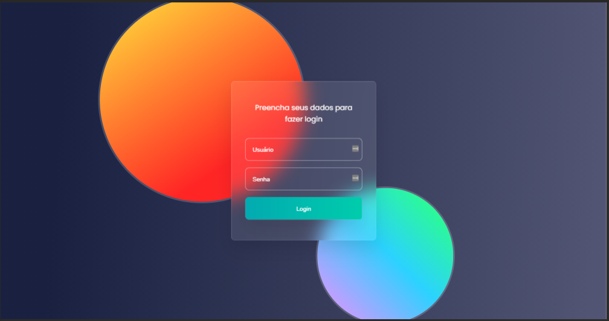

[![LinkedIn][linkedin-shield]][linkedin-url]

<!-- PROJECT LOGO -->
 

  <h3 align="center">Login | Glassmorphism</h3>

  

    Responsive Screen with Glassmorphism for Login
     
    <a href="https://github.com/sbrenomartins/responsive-signin-signup"><strong>Explore the docs »</strong></a>
     
     
    <a href="https://github.com/sbrenomartins/glassmorphism-login">View Demo</a>
    ·
    <a href="https://github.com/sbrenomartins/glassmorphism-login/issues">Report Bug</a>
    ·
    <a href="https://github.com/sbrenomartins/glassmorphism-login/issues">Request Feature</a>
  

  
  

    
  

  
    
    
  

<!-- CONTACT -->
## Contact 📱

Breno Martins - sbrenomartins.github.io - sbrenomartins@gmail.com

Project Link: [https://github.com/sbrenomartins/glassmorphism-login](https://github.com/sbrenomartins/glassmorphism-login)

<!-- MARKDOWN LINKS & IMAGES -->
<!-- https://www.markdownguide.org/basic-syntax/#reference-style-links -->
[linkedin-shield]: https://img.shields.io/badge/-LinkedIn-black.svg?style=flat-square&logo=linkedin&colorB=555
[linkedin-url]: https://linkedin.com/in/breno-m-silva